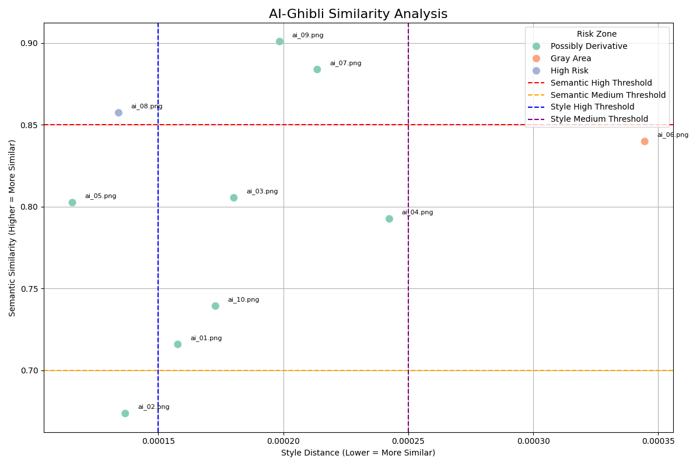

# Studio Ghibli v. OpenAI: Ghibli Style Dectector
**Vinh Tran**

## Project Description

In March 2025, OpenAI released a viral image-generation feature allowing users to render photos “in the style of Studio Ghibli.” With just a prompt, users could “Ghiblify” their pets, political events, memes, or even historical moments. These images mimicked the warmth, stylization, and visual language of Hayao Miyazaki’s hand-drawn films, but none were made or endorsed by Studio Ghibli.

The backlash was immediate and complex. Ethically, it reignited debates over AI’s impact on creative labor. Legally, it posed a harder question: can an aesthetic “style” be protected under copyright or trademark law? And if so, how should courts treat AI-generated works that evoke, but don’t duplicate, an iconic artistic style?

This paper explores that question through both a legal analysis and technical implementation. We built a computational tool that uses a pre-trained vision model (VGG19) and OpenAI’s Contrastive Language-Image Pre-Training (CLIP) architecture to compare AI-generated Ghibli-style images with authentic stills from Studio Ghibli films. We argue that this tool provides empirical scaffolding for key IP doctrines,  namely copyright’s substantial similarity test, fair use, and trademark dilution under the Lanham Act,  and can guide future adjudications in cases involving AI aesthetic replication.


## Set Up

### Local

**Note: it is recommended to use a virtual environment for python**

```bash
# activate
$ python3 -m venv .venv
$ source .venv/bin/activate

# deactivate
$ deactivate
```

**Install packages in virtual environment**
```bash
$ pip install -r requirements.txt
```

### Google Colab

**No need for special setup, but it is important you must 1) replicate the file structure (or modify to your structure) and 2) mount to your google drive and install the CLIP library (already in the code)**

## Running the Code
To run the python notebook, just run all the cells (click play)

## Folder Structure
- `ghibli_data`
    - `ghibli_ai`: ai-generated (SORA) Ghibli images
    - `ghibli_real`: real ghibli images
- `results`: contains the csv file of the similarity results and the plot
- `similarity_test.ipynb`: main code to run the python script

## Results
### Ghibli-Style AI Image Similarity Plot

This scatter plot visualizes average **style distance** (x-axis) and **semantic similarity** (y-axis) for AI-generated images compared to Studio Ghibli stills. Risk zones are color-coded by legal exposure.



### Similarity Results in Table

[Similarity Results](results/similarity_results.csv)

## References
### AI Images (Prompts) – in folder `ghibli_data/ghibli_ai`:
ai_01: “In studio ghibli style, create an image of Yale students frolicking on cross campus with the sun out, green grass, and pink cherry blossom trees.” [original prompt]

ai_02: “In studio ghibli style, create an image of a man riding horseback in Iceland, passing glaciers and waterfalls.” [original prompt]

ai_03: “In studio ghibli style, create an image of a fire cooking breakfast in a pan.” [mimic ghibli_03]

ai_04: “In studio ghibli style, create an image of a boy screaming of excitement in a blossoming field, next to a dog and scarecrow.” [mimic ghibli_04]

ai_05: “In studio ghibli style, create an image of a kid running on water to catch a football.” [original prompt]

ai_06: “In studio ghibli style, create an image of a girl running alongside large fish in the water.” [mimic ghibli_06]

ai_07: “In studio ghibli style, create an image of a two cart train riding on clear water during a soft sunset with some clouds.” [mimic ghibli_07]

ai_08: “ In studio ghibli style, create an image of a kid riding their dragon in the night sky.” [original prompt]

ai_09: “In studio ghibli style, create an image of a dad riding a bike with his two kids.” [mimic ghibli_09]

ai_10: [famous meme obtained online](https://huggingface.co/blog/LLMhacker/ghibli-ai-image)

### Scenes of Real Ghibli-Style Images – in folder `ghibli_data/ghibli_real`: (obtained from [studio website](https://www.ghibli.jp/works/))

ghibli_01: Castle in the Sky

ghibli_02: Castle in the Sky

ghibli_03: Howl’s Moving Castle

ghibli_04: Howl’s Moving Castle

ghibli_05: Ponyo

ghibli_06: Ponyo

ghibli_07: Spirited Away

ghibli_08: Spirited Away

ghibli_09: My Neighbor Totoro

ghibli_10: My Neighbor Totoro

